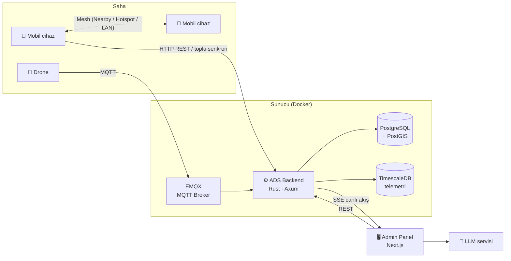

# 🚨 ADS — Acil Durum Sistemi

> 🥈 **Balıkesir Hackathonu (EBHACK '26) — 2.’lik ödülü** · Takım: **Insomnia Mentally**

**ADS (Acil Durum Sistemi)**, deprem gibi afet anlarında iletişim kopukluğunu en aza indiren, enkaz altında kalan ya da acil yardıma ihtiyaç duyan kişileri tespit edip AFAD ve kriz yönetim merkezlerine ulaştıran uçtan uca bir afet müdahale ekosistemidir.

Telefonlar sarsıntıyı kendi sensörleriyle algılar, internet kesilse bile birbirleri üzerinden (mesh) haberleşir, cihaz içinde çalışan yapay zekâ asistanı afetzedeyle konuşur; kriz masası ise tüm ihbarları, drone filosunu ve deprem verisini tek bir canlı haritada izler.

📊 Hackathon sunumu: [`docs/INSOMNIA-MENTALLY-sunum.pptx`](./docs/INSOMNIA-MENTALLY-sunum.pptx)

---

## ✨ Öne Çıkan Özellikler

### 📱 Afetzede tarafı (Android)
- **Otomatik sarsıntı algılama** — İvmeölçer verisi STA/LTA algoritmasıyla arka planda, kilit ekranında bile sürekli izlenir.
- **Kitle kaynaklı deprem tespiti** — Aynı bölgedeki çok sayıda cihazın sarsıntı bildirimi sunucuda birleştirilerek deprem doğrulanır.
- **İnternetsiz haberleşme (P2P Mesh)** — Google Nearby Connections, Wi-Fi hotspot ve LAN relay ile cihazlar birbirine veri aktarır; bağlantı bulan ilk cihaz birikmiş ihbarları toplu olarak sunucuya iletir (gossip protokolü).
- **Çevrimdışı yapay zekâ asistanı** — Cihaz üzerinde çalışan **Gemma** (LiteRT-LM) modeli ve **Vosk** Türkçe ses tanıma ile internet yokken bile sesli yönlendirme.
- **Durum bildirimi** — "İyiyim / Enkaz altındayım / Yaralıyım" durumları konumla birlikte gönderilir; gönderilemeyenler kuyrukta bekletilir.

### 🖥️ Kriz merkezi tarafı (Admin Panel)
- **Canlı harita** — İhbarlar, afetzede konumları ve drone'lar SSE ile anlık güncellenen kümelenmiş harita üzerinde.
- **Drone filosu yönetimi** — Telemetri takibi, haritadan waypoint ile yönlendirme, isteğe bağlı kamera/video akışı.
- **Yapay zekâ analizi** — Drone bulguları ve ihbarlar üzerinden LLM destekli önceliklendirme ve rota önerisi.
- **Deprem izleme** — Webhook ile gelen deprem olayları ve kitle kaynaklı deprem logları, deprem anında panel genelinde uyarı bandı.
- **Kullanıcı ve log yönetimi**, veritabanı SQL yedeği dışa aktarma.

### ⚙️ Sunucu tarafı (Backend)
- Rust + Axum ile yüksek eşzamanlılıkta asenkron API.
- MQTT (EMQX) üzerinden cihaz/drone mesajlaşması, kopan bağlantılarda paket kaybını azaltır.
- PostGIS ile coğrafi sorgular ("yakınımdaki afetzedeler" radarı), TimescaleDB ile drone telemetrisi.
- Drone ve deprem senaryolarını üreten simülatör (`cargo run --bin simulate`).

---

## 🏗️ Mimari



---

## 🧰 Teknoloji Yığını

| Bileşen | Teknolojiler |
|---|---|
| **Backend** | Rust (edition 2024), Axum, Tokio, SQLx, rumqttc, dotenvy |
| **Veri & Mesajlaşma** | PostgreSQL 15 + PostGIS, TimescaleDB, EMQX 5 (MQTT) |
| **Admin Panel** | Next.js 16 (App Router), React 19, TypeScript, Tailwind CSS 4, NextAuth v5, Leaflet, Recharts |
| **Mobil** | Kotlin, Android foreground services, Google Nearby Connections, LiteRT-LM (Gemma), Vosk |
| **Altyapı** | Docker, Docker Compose |

---

## 🗂️ Proje Yapısı

```
.
├── ads-backend/        # Rust API sunucusu (+ API.md, simülatör)
├── ads-admin-panel/    # Next.js kriz merkezi paneli
├── ads-mobile/         # Android afetzede uygulaması
├── docs/               # Hackathon sunumu
├── docker-compose.yml  # Backend + PostGIS + TimescaleDB + EMQX
├── init.sql            # Veritabanı şeması (otomatik yüklenir)
└── .env.example        # Tüm bileşenler için tek ortam değişkeni şablonu
```

Modüllere özel teknik notlar:
- [🛠️ Backend Dokümantasyonu](./ads-backend/README.md) · [📡 API Referansı](./ads-backend/API.md)
- [📱 Mobil Dokümantasyonu](./ads-mobile/README.md)
- [🌐 Admin Panel Dokümantasyonu](./ads-admin-panel/README.md)

---

## 🚀 Hızlı Başlangıç

Tüm kurulum **kök dizinden** yapılır; bileşenler tek bir global `.env` dosyasını paylaşır.

### 1. Ortam değişkenleri

```bash
cp .env.example .env
```

`.env` içindeki `LLM_API_KEY`, `AUTH_SECRET` gibi alanları kendi değerlerinizle doldurun. `AUTH_SECRET` için:

```bash
openssl rand -base64 32
```

### 2. Sunucu servisleri

```bash
docker compose up -d --build
```

Veritabanı tabloları ilk açılışta `init.sql` ile otomatik oluşturulur.

| Servis | Adres |
|---|---|
| Backend API | `http://localhost:4030` (sağlık kontrolü: `/health`) |
| PostgreSQL / PostGIS | `localhost:4031` |
| TimescaleDB | `localhost:4032` |
| MQTT (TCP) | `localhost:4033` |
| EMQX Dashboard | `http://localhost:4034` |

### 3. Admin panel

```bash
cd ads-admin-panel
npm install
npm run dev
```

Panel: **http://localhost:3000** — test girişi: `admin123` / `admin12345`

### 4. Simülasyon (isteğe bağlı)

Drone hareketleri ve rastgele deprem ihbarları üretmek için:

```bash
cd ads-backend
cargo run --bin simulate
```

### 5. Mobil uygulama

1. `ads-mobile/` klasörünü Android Studio ile açın.
2. Gradle senkronizasyonu kök dizindeki `.env` dosyasını okuyup `BuildConfig` alanlarını üretir (`ADS_BASE_URL`, `ASSISTANT_BASE_URL` vb.).
3. Sensörlerin gerçekçi çalışması için **fiziksel bir cihazda** test edin. Çevrimdışı Gemma modeli ilk kullanımda indirilir.

> ⚠️ Bu proje bir hackathon prototipidir. Varsayılan şifreler ve test hesapları yalnızca yerel geliştirme içindir; gerçek ortamda mutlaka değiştirilmelidir.

---

## 📄 Lisans

[MIT](./LICENSE) © 2026 ADS Team
